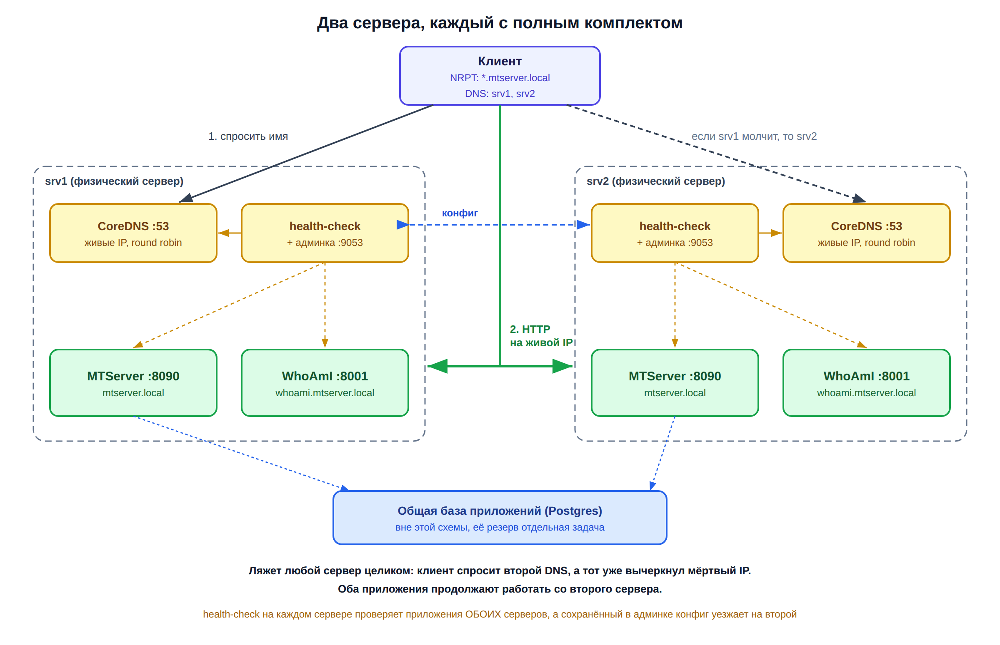
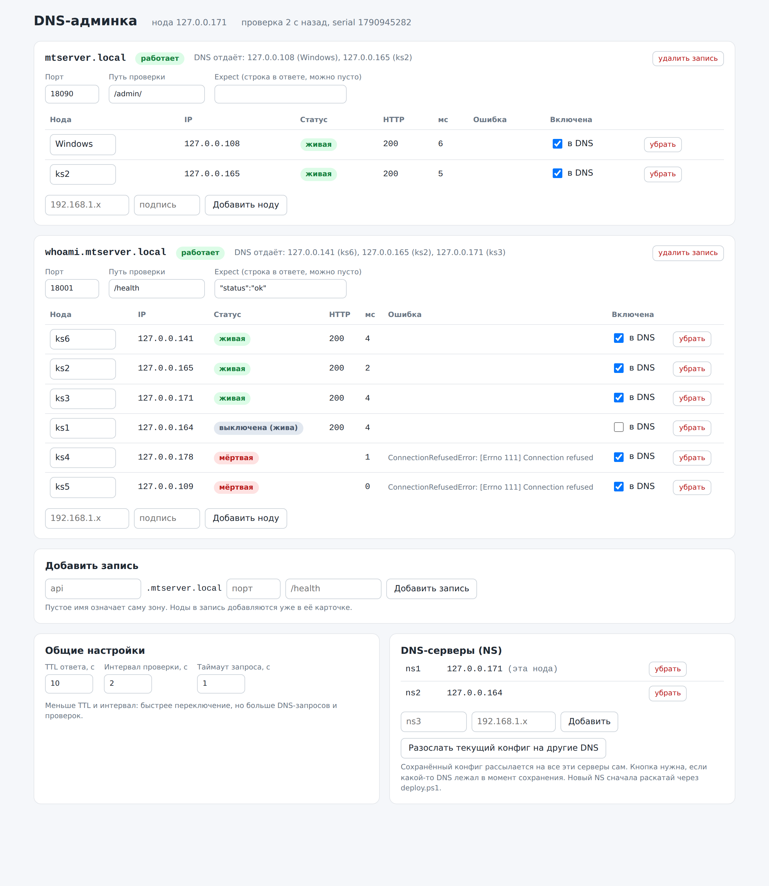
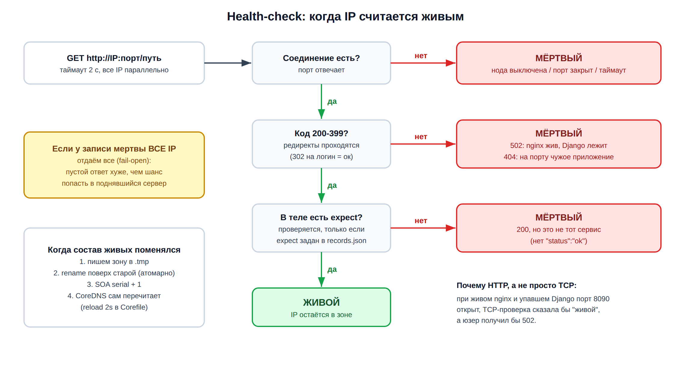
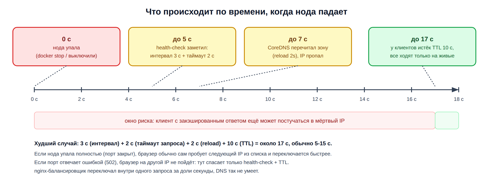

# Отказоустойчивость серверов на CoreDNS

Система, которая ставится на любое количество серверов: на каждом крутятся приложения, CoreDNS и health-check с веб-админкой. Клиенты обращаются к сервису по имени (`app.example.local`), а DNS отдаёт только IP тех серверов, где приложение реально живо. Ляжет сервер целиком или только приложение на нём, и через 5-15 секунд все пойдут на остальные.

Начать можно с двух серверов, а потом доливать новые: добавил в `inventory.json`, запустил раскатку, готово.



*На схеме два сервера. Третий и следующие подключаются точно так же.*

Без балансировщика и прокси: нет отдельной машины, которая сама могла бы стать единой точкой отказа.

## Что будет при отказе

| Что сломалось | Что видит пользователь | Сколько длится |
|---|---|---|
| Упало приложение на одном сервере (контейнер остановлен, порт закрыт) | работает с остальных | 5-15 с, худший случай около 17 с |
| На сервере жив nginx, а приложение за ним отдаёт 502 | работает с остальных: проверка идёт по HTTP, а не по порту | 5-15 с |
| Упал CoreDNS на одном сервере | ничего не замечает, отвечает другой DNS | около секунды на запрос, пока Windows переключается |
| Сервер выключился или отвалился от сети | работает с остальных | 5-15 с |
| Лежат все серверы с этим приложением | не работает, резервировать некуда | |
| Упала общая база приложения | не работает | база в эту схему не входит |

Почему не мгновенно: health-check проверяет раз в 3 с (плюс таймаут 2 с), CoreDNS перечитывает зону раз в 2 с, а клиенты держат ответ DNS до 10 с (TTL). Всё это настраивается в `inventory.json`.

## Конфигурация: что где лежит

В коде нет IP, паролей, портов и имён зон, только значения по умолчанию. Всё, что зависит от окружения, лежит в двух файлах, и оба **не коммитятся**:

| Файл | Что в нём | В git |
|---|---|---|
| `inventory.json` | серверы, записи, порты, версии образов, пути на серверах | нет, в репо лежит `inventory.example.json` |
| `.env` | секреты: `ADMIN_PASSWORD` | нет, в репо лежит `.env.example` |

`deploy.ps1` собирает из них `.env` для каждого сервера (`~/coredns/.env`, права 600), а контейнеры берут оттуда переменные: `docker-compose.yml` через `${VAR}`, CoreDNS через `{$VAR}` прямо в Corefile, health-check через `os.environ`. Полный список переменных с описанием лежит в [`dns/.env.example`](dns/.env.example).

Пароль можно не хранить в файле вовсе: если задана переменная окружения `DNS_ADMIN_PASSWORD`, скрипты берут его оттуда (удобно для CI или менеджера секретов).

Версии образов зафиксированы (`coredns/coredns:1.12.0`, `python:3.12-slim`), а не `latest`, чтобы обновление было осознанным: поменял версию в `inventory.json`, раскатал. Health-check работает не от root.

## Что нужно

- **Linux-серверы** с Docker и плагином `docker compose`, в одной сети с клиентами. Пользователь из `ssh_user` в группе `docker`.
- **Открытые порты:** 53/udp и 53/tcp (DNS), порт админки (9053/tcp по умолчанию), порты приложений. Если включён ufw: `sudo ufw allow 53 && sudo ufw allow 9053/tcp`.
- **Приложения уже работают на серверах** на одинаковых портах. Проект их не ставит, а только проверяет и переключает (кроме тестового WhoAmI, его ставит `deploy.ps1`). Если приложение ходит в базу, база должна быть общей или реплицированной.
- **Windows-машина**, с которой раскатываешь: PowerShell 5.1+, встроенный OpenSSH (`ssh`, `scp`) и `tar` (есть в Windows 10/11).
- **VPN выключен** или настроен split tunneling для локальной сети: многие VPN режут DNS-запросы мимо туннеля.

## Установка

**1. Конфиг окружения.**

```powershell
copy inventory.example.json inventory.json
copy .env.example .env          # можно пропустить: deploy.ps1 сам сгенерирует пароль
```

В `inventory.json` впиши серверы и записи (описание полей ниже). Пока там стоят заглушки `x.x.x.x`, скрипты не запустятся.

**2. Вход по SSH-ключу**, иначе пароль спросят много раз:

```powershell
ssh-keygen -t ed25519            # если ключа ещё нет
type $env:USERPROFILE\.ssh\id_ed25519.pub | ssh <ssh_user>@<IP сервера> "mkdir -p ~/.ssh && cat >> ~/.ssh/authorized_keys"
```

Повтори для каждого сервера.

**3. Раскатка:**

```powershell
powershell -ExecutionPolicy Bypass -File .\deploy.ps1
```

Ставит WhoAmI и CoreDNS + health-check + админку на все серверы из `inventory.json`, потом сам проверяет приложения, DNS и админки.

**4. Клиенты** (PowerShell **от администратора**, на каждой машине, откуда ходят в сервис):

```powershell
powershell -ExecutionPolicy Bypass -File .\client-dns.ps1
```

Добавляет NRPT-правило: имена зоны спрашивать у всех DNS-серверов из `inventory.json`, остальное как раньше. Убрать: `.\client-dns.ps1 -Remove`.

**5. Проверка отказоустойчивости:**

```powershell
powershell -ExecutionPolicy Bypass -File .\test-failover.ps1
```

Тест по очереди для каждого сервера:

- `app`: гасит приложение (для каждой записи) и проверяет, что IP пропал из ответа **всех** DNS, а сайт по имени открывается. Потом поднимает и проверяет, что IP вернулся;
- `dns`: гасит CoreDNS и проверяет, что имена резолвятся через остальные DNS;
- `server`: гасит на сервере **всё сразу** (приложения, CoreDNS, health-check) и проверяет, что сайты открываются с остальных.

После каждого шага всё поднимается обратно, даже если проверка упала. В конце выводится таблица PASS/FAIL со временем переключения. Можно гонять по частям: `-Only app`, `-Only dns,server`, `-Server srv3`.

Настоящее выключение сервера (питание, сеть) скрипт не делает. Его стоит один раз проверить руками.

## inventory.json

| Поле | Что это | По умолчанию |
|---|---|---|
| `ssh_user` | пользователь для SSH на серверах | обязательно |
| `zone` | DNS-зона, все имена записей должны быть в ней | обязательно |
| `paths.dns`, `paths.whoami` | куда класть файлы на серверах | `~/coredns`, `~/whoami` |
| `dns.ttl`, `dns.interval`, `dns.timeout` | TTL ответа, интервал проверки, таймаут одной проверки (с) | 10, 3, 2 |
| `dns.admin_port`, `dns.admin_user` | порт и логин админки | 9053, `admin` |
| `dns.upstream` | куда CoreDNS отправляет остальные запросы: один IP или файл resolv.conf | `/etc/resolv.conf` |
| `dns.coredns_image`, `dns.python_image` | версии образов | `coredns/coredns:1.12.0`, `python:3.12-slim` |
| `whoami.port` | порт тестового приложения | 8001 |
| `servers[].name`, `ip` | имя (для подписей и ссылок из записей) и IP сервера | обязательно |
| `servers[].dns` | ставить ли CoreDNS + health-check + админку | |
| `servers[].whoami` | ставить ли тестовое приложение | |
| `records.<имя>.port`, `path` | куда стучится health-check: `http://IP:port/path` | обязательно |
| `records.<имя>.expect` | строка, которая должна быть в ответе; пусто значит, что хватит кода 200-399 | пусто |
| `records.<имя>.servers` | на каких серверах работает приложение | |
| `records.<имя>.stop`, `start` | команды, которыми автотест гасит и поднимает приложение | |

## Добавить сервер

1. Допиши его в `servers` и в `servers` нужных записей в `inventory.json`.
2. Раскатай только его:

   ```powershell
   .\deploy.ps1 -Nodes <IP нового сервера>
   ```

   Скрипт поставит на него всё нужное и **дольёт** новый сервер в живой конфиг остальных DNS через API админки: добавит его IP в записи, а если на нём есть DNS, то и в список NS. То, что ты менял в админке руками, не трогается.
3. Если новый сервер с DNS, перезапусти `client-dns.ps1` на клиентах, чтобы они знали про новый DNS.
4. Прогони тест на нём: `.\test-failover.ps1 -Server <имя>`.

Сколько ставить DNS: хватит двух-трёх серверов с `"dns": true`. Приложения можно держать хоть на всех.

## Убрать сервер

1. В админке выключи его тумблером «в DNS» (клиенты уйдут с него за 10-15 с), потом убери из записей и из NS.
2. Убери его из `inventory.json`.
3. На самом сервере: `cd ~/coredns && docker compose down` (и `cd ~/whoami && docker compose down`, если ставился).
4. Если на нём был DNS, перезапусти `client-dns.ps1` на клиентах.

Сбросить живой конфиг целиком к `inventory.json`: `.\deploy.ps1 -Only dns -ResetConfig`.

## Админка

`http://<IP DNS-сервера>:9053/`, логин и пароль из `inventory.json` и `.env`. Админка есть на каждом DNS-сервере, конфиг у всех общий.



*(скриншот с демо-стенда на localhost)*

- статус каждого сервера по каждой записи: живой, мёртвый или выключен, HTTP-код, время ответа, ошибка; что DNS отдаёт прямо сейчас;
- тумблер **«в DNS»**: вывести сервер на обслуживание без остановки контейнеров. Перед обновлением выключаешь, ждёшь 10-15 с, обновляешь, включаешь;
- добавить или убрать сервер в записи, поменять порт, путь, `expect`, TTL, интервалы, список NS; добавить запись;
- «Сохранить и применить»: применяется сразу и рассылается на остальные DNS. Если какой-то лежал, потом нажми «Разослать текущий конфиг».

API (Basic-auth): `GET /api/state`, `PUT /api/config`, `POST /api/sync`, `POST /api/check`.

## Как это устроено

1. Клиент спрашивает имя у первого DNS из списка. Если тот молчит, Windows через секунду спрашивает следующий.
2. CoreDNS отдаёт из zone-файла только живые IP, каждый раз в новом порядке (round robin, плагин `loadbalance`).
3. Клиент идёт на первый IP из ответа напрямую.

Health-check на каждом DNS-сервере независимо проверяет приложения **на всех** серверах и пишет свой zone-файл. Поэтому, когда один сервер лёг целиком, остальные уже сами вычеркнули его из ответа.



- **Проверка по HTTP:** живой = код 200-399 (редиректы проходятся) и, если задан, `expect` в теле ответа. Ловится и 502 от живого nginx, и чужое приложение на том же порту.
- **Fail-open:** если по записи мертвы все включённые серверы, DNS отдаёт их все: пустой ответ хуже, чем шанс попасть в уже поднявшийся сервер.
- **Зона пишется атомарно** (`.tmp` + `rename`, SOA serial + 1), CoreDNS перечитывает её сам, без рестарта.
- **Защита от путаницы:** health-check не примет конфиг с зоной, отличной от `DNS_ZONE` своей ноды.



## Файлы

| Файл | Что делает |
|---|---|
| `inventory.example.json` | пример окружения: скопировать в `inventory.json` |
| `.env.example` | пример секретов: скопировать в `.env` |
| `deploy.ps1` | раскатка по SSH и доливка новых серверов в живой конфиг |
| `client-dns.ps1` | NRPT-правило на Windows-клиенте (от администратора) |
| `test-failover.ps1` | автотест отказов с таблицей PASS/FAIL |
| `scripts/inventory.ps1` | чтение и проверка `inventory.json` и `.env`, значения по умолчанию |
| `dns/Corefile` | конфиг CoreDNS, все значения из переменных окружения |
| `dns/docker-compose.yml` | контейнеры `coredns` и `healthcheck` (host network), значения из `.env` |
| `dns/.env.example` | все переменные DNS-ноды с описанием |
| `dns/healthcheck.py` | health-check, генерация зоны, веб-админка, синхронизация (только stdlib Python) |
| `dns/admin.html` | страница админки |
| `whoami/` | тестовое приложение: показывает, какой сервер ответил |
| `docs/NOTES.md` | как к этому пришёл: nginx, статичная зона, засады, тесты на стенде |

На сервере: `~/coredns` (там `.env`, `config/records.json` с живым конфигом и `zones/`) и `~/whoami`.

## Ограничения

- **Переключение не мгновенное:** 5-15 с. Клиент с закэшированным ответом успевает постучаться в мёртвый сервер. Если нужно переключение внутри одного запроса, ставь прокси-слой (nginx/HAProxy) на несколько серверов и резолви уже его.
- **База приложения не резервируется.** Если все копии ходят в одну базу, она остаётся единой точкой отказа.
- **DNS не знает про порты:** он отдаёт IP сервера, а какое приложение ответит, решает порт в адресе.
- **Имя работает только у настроенных клиентов:** NRPT на каждой машине или раздача DNS-серверов через DHCP роутера.
- **hosts-файл перебивает DNS:** если в `hosts` прописано имя из зоны, для этой машины переключения не будет.
- **Нет приоритетов:** запросы делятся между серверами поровну. Держать сервер только в запасе можно тумблером в админке.
- **Upstream один:** `{$VAR}` в Corefile подставляется одним словом, поэтому `dns.upstream` это один IP или файл со списком.

## Шпаргалка

```powershell
Resolve-DnsName app.example.local -Server <IP DNS> -DnsOnly   # что отдаёт конкретный DNS
Resolve-DnsName app.example.local                             # что видит Windows
ssh <user>@<IP> "docker logs -f dns-healthcheck"              # кто жив, кто нет, когда менялась зона
ssh <user>@<IP> "docker logs coredns --tail 30"
.\deploy.ps1 -Only dns                                        # обновить DNS-часть
.\deploy.ps1 -Nodes <IP>                                      # раскатать новый сервер
.\test-failover.ps1 -Only app                                 # быстрый прогон отказов приложений
```
