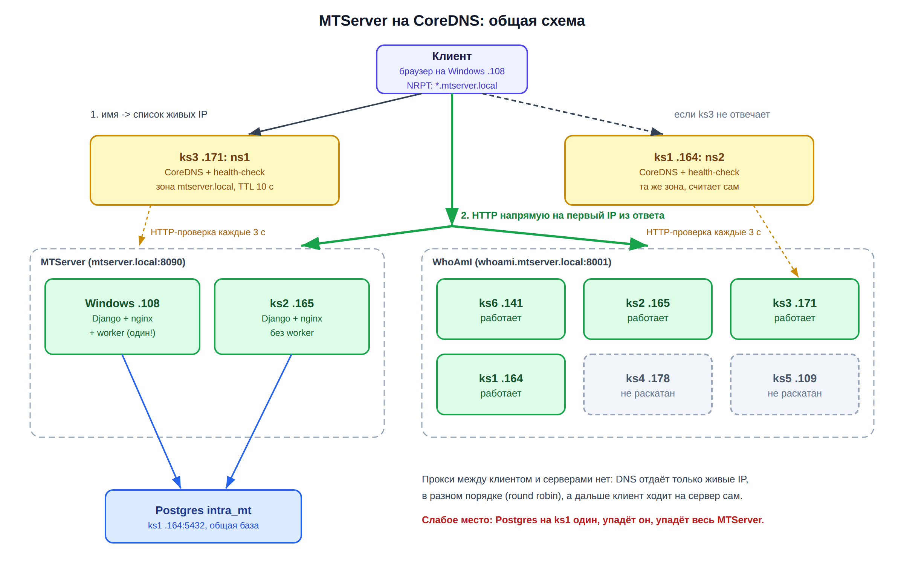
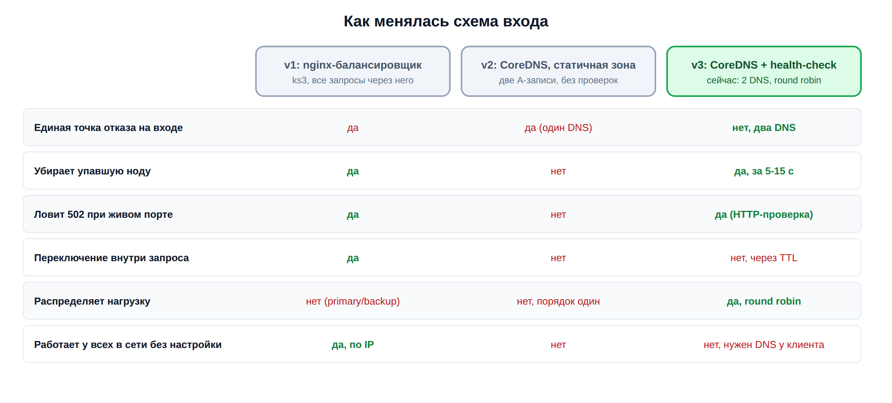
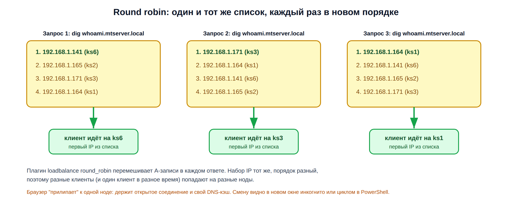
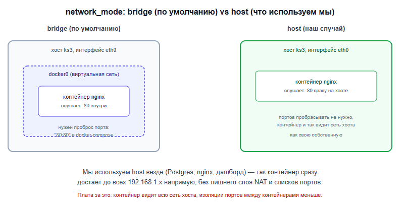
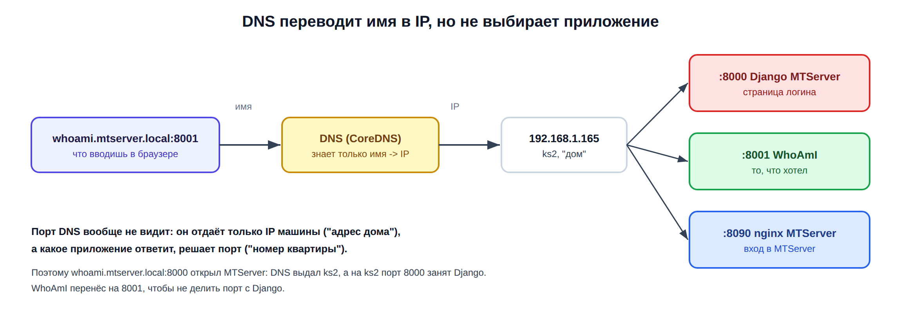
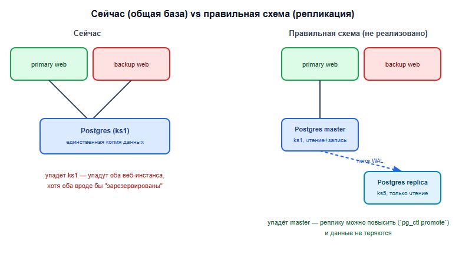

# Как к этому пришёл: история, засады, тесты

Это рабочий журнал лабораторного стенда (ks1-ks6 + Windows), на котором схема обкатывалась. Актуальная инструкция для двух серверов: [README](../README.md).

## Отказоустойчивость MTServer на CoreDNS: health-check, round robin, два DNS

Задача: веб-приложение MTServer должно продолжать работать, если одна из машин легла, а юзер этого почти не заметил. Всё ниже реально развёрнуто и проверено на моём железе: шесть мини-ПК (ks1-ks6) плюс Windows-машина с основным инстансом.

Сначала схема была на nginx-балансировщике, потом я заменил его на CoreDNS. Первая версия на CoreDNS оказалась слабой (статичная зона, мёртвые IP никуда не девались), поэтому дописал к ней свой health-check, round robin и второй DNS-сервер. Эта заметка описывает текущую схему, а nginx остался только в разделе "как к этому пришёл".



## 1. Что в итоге получилось

- Имя `mtserver.local` резолвится только в **живые** ноды MTServer (Windows `.108` и ks2 `.165`).
- Живость проверяет мой демон health-check: раз в 3 секунды делает настоящий HTTP-запрос к каждой ноде. Упала нода, через 5-15 секунд её IP пропадает из DNS. Поднялась, IP возвращается сам.
- **Round robin**: CoreDNS на каждый запрос отдаёт список живых IP в новом порядке, нагрузка размазывается по нодам.
- **Два DNS-сервера** (ks3 и ks1), у каждого свой health-check. Ляжет один, отвечает второй. Единой точки отказа на входе больше нет.
- Для наглядных тестов поднял маленькое приложение **WhoAmI** (FastAPI) на нескольких нодах под именем `whoami.mtserver.local`. На его странице видно, какая нода ответила: так проще всего смотреть на round robin и переключение.
- Вся раскатка делается одним PowerShell-скриптом с Windows.

## 2. Роли нод

| Нода | IP | Что на ней в этой схеме |
|---|---|---|
| Windows | 192.168.1.108 | MTServer primary: Django + nginx + worker, порт 8090. Отсюда же и тестирую как клиент |
| ks1 | 192.168.1.164 | Postgres `intra_mt` (общая база для обоих MTServer), CoreDNS ns2 + health-check, WhoAmI :8001 |
| ks2 | 192.168.1.165 | MTServer backup: Django + nginx без worker, порт 8090 (Django ещё и на 8000), WhoAmI :8001 |
| ks3 | 192.168.1.171 | CoreDNS ns1 + health-check, WhoAmI :8001, дашборд :9000 |
| ks4 | 192.168.1.178 | WhoAmI, пока не раскатан: SSH рвёт соединение |
| ks5 | 192.168.1.109 | WhoAmI, пока не раскатан |
| ks6 | 192.168.1.141 | WhoAmI :8001 |

Worker MTServer есть только на Windows и задублирован не будет: у него уникальные `WORKER_ID`/`WORKER_TOKEN`, вторая копия начала бы дважды обрабатывать одни и те же сообщения из Kafka.

## 3. Как к этому пришёл



**v1, nginx-балансировщик на ks3.** Работал отлично: `upstream` с primary и `backup`, `proxy_next_upstream` переключал на backup прямо внутри одного запроса, юзер ничего не замечал. Но сам балансировщик был единственной точкой входа: выключил ks3, и легло всё, хотя оба MTServer были живы.

**v2, CoreDNS со статичной зоной.** Убрал прокси совсем: имя `mtserver.local` резолвится сразу в два IP, клиент ходит на сервер напрямую. Проблемы вылезли на тестах:
- зона статичная, CoreDNS просто зачитывает файл и не проверяет, живы ли ноды. Мёртвый IP так и оставался в ответе;
- если на Windows лежал только Django, а nginx перед ним был жив, браузер получал 502 и на второй IP не шёл: соединение-то установилось;
- DNS-сервер был один, то есть точка отказа просто переехала с nginx на CoreDNS.

**v3, текущая.** Тот же CoreDNS, но зону пишет health-check по результатам HTTP-проверок, плюс round robin и второй DNS-сервер.

## 4. Как проходит один запрос

1. Браузер хочет открыть `mtserver.local:8090`. Windows по NRPT-правилу спрашивает про `*.mtserver.local` у ks3 (если тот молчит, у ks1).
2. CoreDNS отвечает из zone-файла: только живые IP, в перемешанном порядке, TTL 10 секунд.
3. Браузер подключается к первому IP из списка напрямую, без всяких прокси.

Параллельно, независимо от запросов, на каждой DNS-ноде крутится health-check: проверяет все бэкенды и, если состав живых поменялся, переписывает зону. CoreDNS сам замечает новую зону за 2 секунды.

## 5. Health-check


Это мой Python-скрипт [`dns/healthcheck.py`](../dns/healthcheck.py) (только стандартная библиотека), крутится в контейнере `python:3.12-slim` рядом с CoreDNS. Что проверять, лежит в `config/records.json` на ноде (стартовый вариант генерируется из [`inventory.example.json`](../inventory.example.json)), а править его удобнее всего через веб-админку (раздел 10).

Решения, которые за этим стоят:

- **HTTP, а не TCP.** При живом nginx и упавшем Django порт 8090 открыт, и TCP-проверка сказала бы "живой", а юзер получил бы 502. Ровно на этом спотыкалась v2.
- **Живой только при коде 200-399.** Редиректы `urllib` проходит сам, поэтому `/admin/` с 302 на страницу логина считается нормой. Сначала у меня было "живой, если код меньше 500", и это пропустило чужое приложение (подробнее в засадах).
- **`expect` для WhoAmI.** Мало ответить 200, в теле должен быть `"status":"ok"`. Так чужой сервис на том же порту за живой не сойдёт.
- **Все IP проверяются параллельно** (пул потоков), поэтому мёртвые ноды с таймаутом 2 секунды не тормозят проверку остальных.
- **Fail-open.** Если у записи мертвы все IP, отдаю их все: пустой ответ хуже, чем шанс попасть в уже поднявшийся сервер.
- **Зона пишется атомарно и только при изменении**: сначала `.tmp`, потом `rename` поверх старой, SOA serial + 1. CoreDNS видит новый serial и перечитывает зону.
- Папка `zones` монтируется в оба контейнера целиком, а не отдельным файлом. При монтировании одного файла `rename` подменил бы inode, и CoreDNS продолжал бы видеть старый файл.

Логи демона показывают каждое изменение:

```
[03:33:03] zone changed mtserver.local: alive=['192.168.1.108', '192.168.1.165'] dead=[] serial=1790825583
[03:33:03] zone changed whoami.mtserver.local: alive=['192.168.1.165', '192.168.1.141'] dead=['192.168.1.109', '192.168.1.178'] serial=1790825583
```

## 6. Сколько времени занимает переключение


В худшем случае около 17 секунд: 3 с интервал проверки + 2 с таймаут запроса + 2 с перечитывание зоны + 10 с TTL у клиентов. Обычно выходит 5-15 секунд. Если нода упала целиком (порт закрыт), браузер чаще всего сам пробует следующий IP из списка и переключается быстрее.

Это главный минус по сравнению с nginx: тот переключал внутри одного запроса за доли секунды. DNS так не умеет, он может только перестать выдавать мёртвый адрес.

## 7. Round robin



Делается одной строкой в Corefile: плагин `loadbalance round_robin` перемешивает A-записи в каждом ответе. Набор IP тот же, порядок каждый раз другой, а клиент обычно берёт первый.

Важный момент: браузер "прилипает" к одной ноде. Он держит открытым соединение (keep-alive) и кэширует DNS сам, поэтому `F5` почти всегда показывает ту же ноду. Это не поломка. Смену нод видно в новом окне инкогнито или циклом в PowerShell, где каждый запрос идёт с чистым кэшем:

```powershell
1..10 | % { (Invoke-WebRequest http://whoami.mtserver.local:8001/api -UseBasicParsing | ConvertFrom-Json).server.hostname; Clear-DnsClientCache; Start-Sleep 1 }
```

Для MTServer у round robin есть побочный эффект: primary больше не главный, запросы делятся между Windows и ks2 поровну. Залогиниться это не мешает: сессии Django по умолчанию хранятся в базе, а база общая, так что при переходе с ноды на ноду не выкидывает.

## 8. Резерв самого DNS

CoreDNS с health-check стоит на двух нодах, ks3 и ks1. Каждая проверяет бэкенды сама, друг от друга они не зависят, и по логам обе приходят к одинаковому результату. В зоне два NS:

```
mtserver.local. 3600 IN SOA ns1.mtserver.local. admin.mtserver.local. 1790825611 7200 3600 1209600 10
mtserver.local. 3600 IN NS ns1.mtserver.local.
mtserver.local. 3600 IN NS ns2.mtserver.local.
ns1.mtserver.local. 3600 IN A 192.168.1.171
ns2.mtserver.local. 3600 IN A 192.168.1.164
mtserver.local. 10 IN A 192.168.1.108
mtserver.local. 10 IN A 192.168.1.165
```

Клиенту прописаны оба сервера (см. раздел 10), так что при падении ks3 Windows спрашивает ks1.

## 9. Конфиги

Актуальные файлы лежат в репозитории, описание в [README](../README.md):

- [`dns/Corefile`](../dns/Corefile): `reload 2s` (по умолчанию `file` перечитывает зону раз в минуту, для фейловера это слишком долго) и `bind <IP ноды>`, чтобы CoreDNS не дрался за порт 53 с системным резолвером;
- [`dns/docker-compose.yml`](../dns/docker-compose.yml): CoreDNS стартует только после того, как health-check записал первую зону (`depends_on` + `service_healthy`);
- [`whoami/docker-compose.yml`](../whoami/docker-compose.yml): тестовое приложение на порту 8001.

Везде `network_mode: host`: контейнер работает прямо на сетевом интерфейсе машины, без проброса портов. WhoAmI из-за этого ещё и показывает настоящий hostname и IP ноды, а не ID контейнера.



## 10. Раскатка и админка

Всё раскатывается с Windows одним скриптом [`deploy.ps1`](../deploy.ps1): для каждой ноды пакует файлы в tar, кидает через `scp`, распаковывает по `ssh` и делает `docker compose up`. Если нода не отвечает, скрипт её пропускает и в конце пишет список проблемных. Клиент настраивает [`client-dns.ps1`](../client-dns.ps1) (NRPT на оба DNS).

Позже в health-check добавилась веб-админка на порту 9053: статусы нод, тумблер «в DNS» для вывода ноды на обслуживание, редактирование записей. Сохранённый конфиг применяется сразу и сам рассылается на второй DNS. Пароль общий для обоих DNS, по нему же они синхронизируются. Подробности в [README](../README.md#админка).


## 11. Засады по ходу

**PowerShell сожрал `$ORIGIN`** (ещё в v2). Zone-файл создавался командой в двойных кавычках, PowerShell принял `$ORIGIN` за свою переменную и подставил пустоту. CoreDNS ругался `dns: not a TTL` и уходил в `restarting` по кругу. Убрал `$ORIGIN`, пишу полные имена в каждой строке. Сейчас зону вообще генерирует скрипт.

**Статичная зона не убирала мёртвый IP.** Погасил primary, а `dig` упорно отдаёт `ANSWER: 2`. CoreDNS с плагином `file` просто зачитывает файл и про живость нод ничего не знает. Отсюда и появился health-check.

**Зона обновлялась раз в минуту.** Health-check переписывал файл за секунды, а CoreDNS подхватывал его только через минуту: у `file` по умолчанию такой интервал перечитывания. Лечится `reload 2s` в Corefile.

**hosts-файл перебивал DNS.** DNS уже отдавал только `.165`, а браузер всё равно ходил на мёртвый `.108` и ловил 502. Причина: ещё со времён борьбы с VPN в `hosts` были прописаны оба IP, а hosts Windows читает раньше любого DNS. Выдал его TTL в `Resolve-DnsName`: `599619` вместо `10` (записи из hosts идут с TTL неделя и тикают вниз). Ещё одна засада: первая правка в блокноте не сохранилась, потому что блокнот был открыт не от админа. Закомментировал строки командой из PowerShell от администратора.

**VPN режет порт 53.** После чистки hosts `Resolve-DnsName mtserver.local` стал падать по таймауту: VPN-клиент блокирует весь DNS мимо своего туннеля (защита от DNS-утечек). Ping до ноды при этом проходит. На время работы с `mtserver.local` VPN приходится выключать, нормальное решение это split tunneling для `192.168.1.0/24`.

**NRPT-правило не покрывало само имя.** Правило на `.mtserver.local` (с точкой) работает для поддоменов, а само `mtserver.local` под него может не попадать. Теперь прописываю оба варианта.

**Проверка "код меньше 500" пропустила чужое приложение.** Открываю `whoami.mtserver.local:8000`, а там логин MTServer. На ks2 порт 8000 занят Django, WhoAmI туда не встал, а health-check считал ks2 живым: на `/health` Django ответил 404, а это меньше 500. Ужесточил проверку до 200-399 плюс `expect` по телу ответа и перенёс WhoAmI на порт 8001.



**DNS не знает про порты.** Из той же истории: DNS переводит имя в IP машины ("адрес дома"), а какое приложение ответит, решает порт ("номер квартиры"). Поэтому любое имя из зоны с портом 8000 или 8090 приводит в MTServer, если DNS выдал машину, где он запущен.

**Fail-open выглядел как зависание.** Когда живых WhoAmI не осталось ни одного, DNS по задумке отдал все IP, браузер взял первый попавшийся мёртвый, а ks4/ks5 не отвечают вообще (не отказ, а таймаут). В итоге страница висела секунд 20-30. Логика верная, но для тестов надо держать живыми хотя бы две ноды.

**Предупреждение спамило каждые 3 секунды.** Когда все бэкенды лежали, health-check писал `WARNING` на каждом цикле. Теперь пишет только при смене состава.

**Выключил ks6, и ничего не открылось.** На тот момент настоящий WhoAmI жил только на ks6 (ks2 с конфликтом порта, ks4 и ks5 не раскатаны), так что запаски просто не было. После переноса на 8001 и раскатки на ks3 и ks1 рабочих нод стало четыре.

**ks4 и ks5 не раскатываются.** На ks4 `scp` сразу падает с `Connection closed` (код 255), сессия SSH даже не поднимается. С ks5 ещё не разбирался. Health-check их честно держит в `dead`.

## 12. Тесты

| Что сделал | Что ожидал | Что получилось |
|---|---|---|
| `docker compose stop web nginx` на Windows | `.108` пропадает из `mtserver.local` | `dig` отдаёт только `.165`, в логах `dead=['192.168.1.108']` |
| `docker compose stop web` на Windows (nginx жив) | частичный отказ тоже ловится | `.108` пропал из DNS. Раньше в v2 тут был 502 |
| `docker compose start web nginx` | IP возвращается | вернулся без перезапуска чего-либо |
| Ноды без WhoAmI (ks4, ks5) | не попадают в ответ | в `dead`, в ответе только живые |
| Несколько `Resolve-DnsName` подряд | разный порядок IP | порядок меняется, `.141` уходил первым при конфиге с `.165` первым |
| Страница WhoAmI | видно, какая нода ответила | отвечали ks6 и ks2 |
| `Resolve-DnsName -Server` к ks3 и к ks1 | оба отвечают одинаково | да, TTL 10, два NS в ответе |
| `docker stop whoami` на одной ноде при четырёх живых | страница открывается с другой ноды | ещё прогнать |
| `docker stop coredns` на ks3 | имя резолвится через ks1 | ещё прогнать |

## 13. Что выключать и что будет с MTServer

| Выключаю | `mtserver.local:8090` |
|---|---|
| Windows (.108) | работает, через 5-15 с всё отдаёт ks2 |
| ks2 (.165) | работает, остаётся Windows |
| ks3 | работает, DNS отвечает ks1 |
| ks4, ks5, ks6 | не влияет, MTServer там нет |
| **ks1 (.164)** | **ляжет всё**: там общий Postgres. DNS переживёт, но обоим MTServer некуда ходить за данными |
| Windows и ks2 вместе | не откроется, копий приложения больше нет |



## 14. Что не закрыто

1. **Postgres на ks1 один на всех.** Самое слабое место всей схемы, round robin его не закрывает. Нужно довести streaming-репликацию (`pg_basebackup -R`) и уметь повышать реплику.
2. **Переключение не мгновенное.** 5-15 секунд против долей секунды у nginx. Если нужно мгновенно, придётся ставить прокси-слой (nginx/HAProxy) на нескольких нодах и уже его резолвить через DNS.
3. **Имя работает только у настроенных клиентов.** Остальным в сети нужно либо NRPT/hosts руками, либо раздать ks3/ks1 как DNS через DHCP роутера (или условную переадресацию `*.mtserver.local`).
4. **VPN.** С включённым VPN имя не резолвится, нужен split tunneling.
5. **ks4 и ks5** не раскатаны: SSH на ks4 рвётся, ks5 не разобран.
6. **Не видно, какая нода отдала страницу MTServer.** У WhoAmI это есть, у MTServer нет. Идея: nginx на каждой ноде добавляет заголовок `X-Served-By` и плашку внизу страницы через `sub_filter`.
7. **Нет приоритета primary.** Round robin делит запросы поровну между Windows и ks2. Если захочется "всё на primary, ks2 только в запас", health-check должен отдавать backup только когда primary мёртв.
8. **Worker не задублирован**, и это осознанно (уникальный ID, двойная обработка Kafka).

## 15. Шпаргалка

Что сейчас отдаёт DNS:

```powershell
Resolve-DnsName mtserver.local -Server 192.168.1.171 -DnsOnly
Resolve-DnsName whoami.mtserver.local -Server 192.168.1.164 -DnsOnly
```

```bash
watch -n 1 'dig @192.168.1.171 mtserver.local +short'
```

Логи health-check и CoreDNS:

```powershell
ssh vlad@192.168.1.171 "docker logs -f dns-healthcheck"
ssh vlad@192.168.1.171 "docker logs coredns --tail 30"
```

Уронить и поднять MTServer:

```powershell
# Windows, в папке PyMTServer
docker compose stop web nginx
docker compose start web nginx

# ks2
ssh vlad@192.168.1.165 "cd /opt/PyMTServer && docker compose stop web nginx"
ssh vlad@192.168.1.165 "cd /opt/PyMTServer && docker compose start web nginx"
```

Уронить и поднять WhoAmI на ноде:

```powershell
ssh vlad@192.168.1.141 "docker stop whoami"
ssh vlad@192.168.1.141 "docker start whoami"
```

Какая нода отвечает (round robin):

```powershell
1..10 | % { (Invoke-WebRequest http://whoami.mtserver.local:8001/api -UseBasicParsing | ConvertFrom-Json).server.hostname; Clear-DnsClientCache; Start-Sleep 1 }
```

Проверить, не перебивает ли hosts-файл:

```powershell
Select-String -Path C:\Windows\System32\drivers\etc\hosts -Pattern mtserver
```

Если в `Resolve-DnsName` TTL огромный (сотни тысяч), ответ пришёл из hosts, а не из CoreDNS.

Адреса:

```
http://mtserver.local:8090/admin/         MTServer
http://whoami.mtserver.local:8001/        WhoAmI, видно ноду
http://192.168.1.171:9000/                дашборд состояния нод
```
